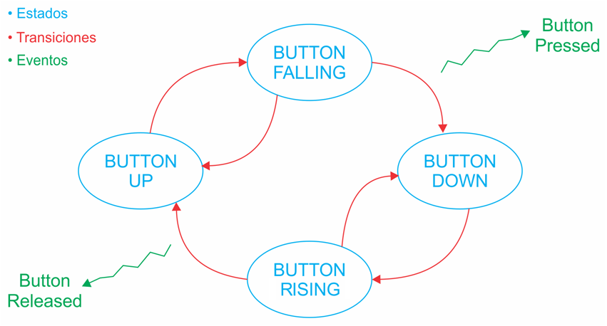

# Práctica 4 Punto 1

**Author**: Luis Alberto Gómez Parada

**Hardware**: STM32F429ZI

## Objetivo
Implementar un MEF para trabajar con anti-rebotes por software.

## Actividad
Crear un nuevo proyecto como copia del proyecto realizado para la práctica 3.

Implementar una MEF anti-rebote que permita leer el estado del pulsador de la placa NUCLEO-F429ZI y generar acciones o eventos ante un flanco descendente o ascendente, de acuerdo al diagrama.



El estado inicial de la MEF debe ser BUTTON_UP.

Implementar dentro de main.c, las funciones:

``` cpp
void debounceFSM_init();		// debe cargar el estado inicial
void debounceFSM_update();	// debe leer las entradas, resolver la lógica de
					// transición de estados y actualizar las salidas
void buttonPressed();			// debe invertir el estado del LED1
void buttonReleased();		// debe invertir el estado del LED3 
```
El tiempo de anti-rebote debe ser de **40 ms** con un retardo no bloqueante como los implementados en la práctica 3.

La función `debounceFSM_update()` debe llamarse periódicamente.

``` cpp
typedef enum{
BUTTON_UP,
BUTTON_FALLING,
BUTTON_DOWN,
BUTTON_RAISING,
} debounceState_t
``` 