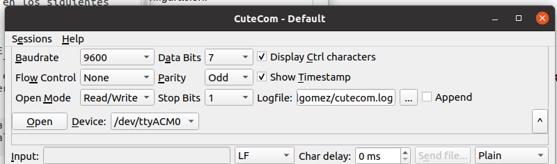
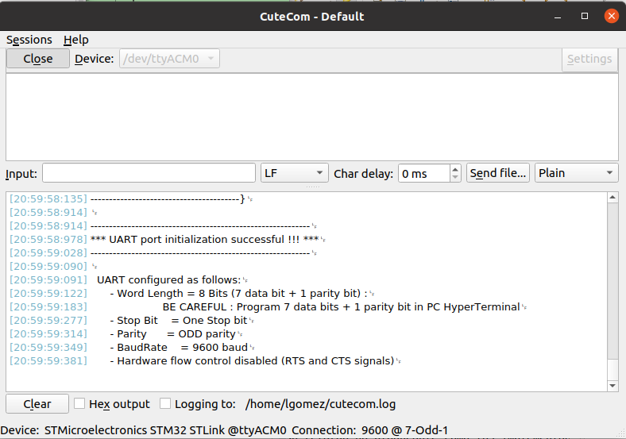

# Práctica 5 Punto 1 (UART)

**Materia** Programación de Microcontroladores

**Author**: Luis Alberto Gómez Parada

**Hardware**: STM32F429ZI

## Objetivo
Implementar un módulo de software sencillo para trabajar con la UART. 
 
---
## Actividad Punto 1

Implementar un módulo de software en un archivos fuente `API_uart.c` con su correspondiente archivo de cabecera API_uart.h y ubicarlos en el proyecto dentro de  las carpetas `/drivers/API/src` y `/drivers/API/inc`, respectivamente.
En API_uart.h se deben ubicar los prototipos de las funciones públicas.


``` cpp
bool_t uartInit();
void uartSendString(uint8_t * pstring);
void uartSendStringSize(uint8_t * pstring, uint16_t size);
void uartReceiveStringSize(uint8_t * pstring, uint16_t size); 
``` 

* Implementacion [Prototipos](https://github.com/cpatagon/PdM_workspace/blob/b324e2c631362bb2f34340817d07b4130840a58d/Practica05_p1/Drivers/API/inc/API_uart.h#L12C1-L46C1)

En `API_uart.c` se deben ubicar los prototipos de las funciones privadas y la implementación de todas las funciones de módulo, privadas y públicas.

### Consideraciones para la implementación:

1. `uartInit()` debe realizar toda la inicialización de la UART.  Adicionalmente, debe imprimir por la terminal serie un mensaje con sus parámetros de configuración.

La función devuelve:

    - `true` : si la inicialización es exitosa.

    - `false` : si la inicialización no es exitosa.
    
* Implementacion [uartInit()](https://github.com/cpatagon/PdM_workspace/blob/b164601fc8f2019ecc6eaddef94abf93963aa3f3/Practica05_p1/Drivers/API/src/API_uart.c#L35C1-L65C5)

2. `uartSendString(uint8_t *pstring)` recibe un puntero a un string que se desea enviar por la UART completo (hasta el caracter ‘\0’) y debe utilizar la función de la `HAL HAL_UART_Transmit(...)` para transmitir el string.

* Implementacion [uartSendString(uint8_t *pstring)](https://github.com/cpatagon/PdM_workspace/blob/b164601fc8f2019ecc6eaddef94abf93963aa3f3/Practica05_p1/Drivers/API/src/API_uart.c#L67C1-L75C1)

3. `uartSendStringSize(uint8_t * pstring, uint16_t size)` recibe un puntero a un string que se desea enviar por la UART y un entero con la cantidad de caracteres que debe enviar. La función debe utilizar `HAL_UART_Transmit(...)` para transmitir el string.

* Implementacion [uartSendStringSize(uint8_t * pstring, uint16_t size)](https://github.com/cpatagon/PdM_workspace/blob/b164601fc8f2019ecc6eaddef94abf93963aa3f3/Practica05_p1/Drivers/API/src/API_uart.c#L76C1-L85C2)

## RESULTADOS 
***Configuracion Terminal UART con cutecom***
 


***Salida Configuración UART en placa STM32***
 



