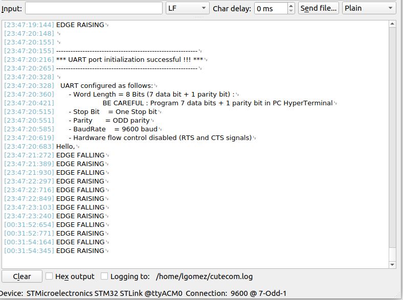

# Práctica 5 Punto 2 (UART)

**Materia** Programación de Microcontroladores

**Author**: Luis Alberto Gómez Parada

**Hardware**: STM32F429ZI

## Objetivo
Implementar un módulo de software sencillo para trabajar con la UART. 
 
---
## Actividad Punto 2

Sobre el ejercicio de la práctica 4, implementar un programa que utilice el módulo de uart para informar al usuario cuando se producen los flancos ascendente y descendente.

## RESULTADOS 
***Configuracion Terminal UART con cutecom***
 

***Salida Configuración UART en placa STM32***
 

