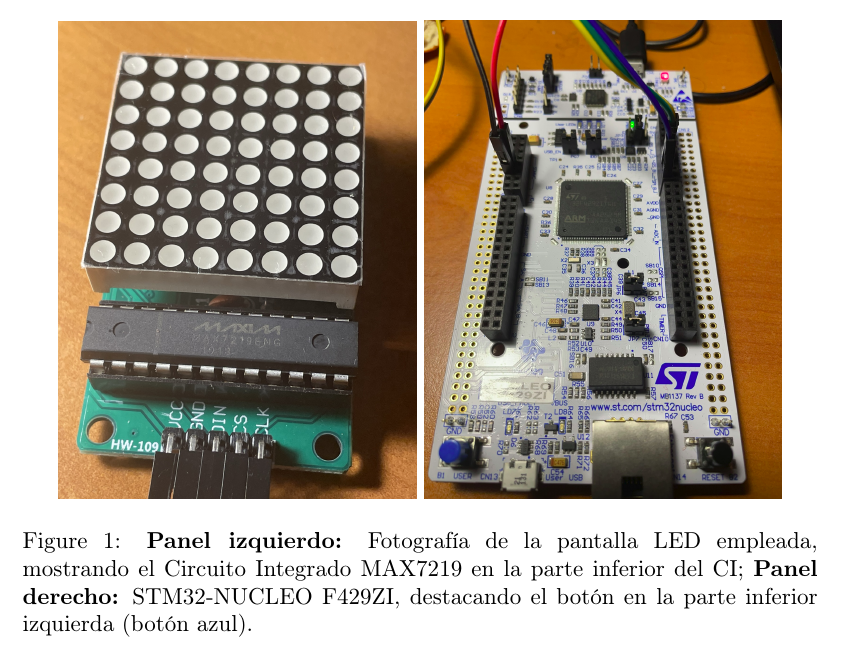
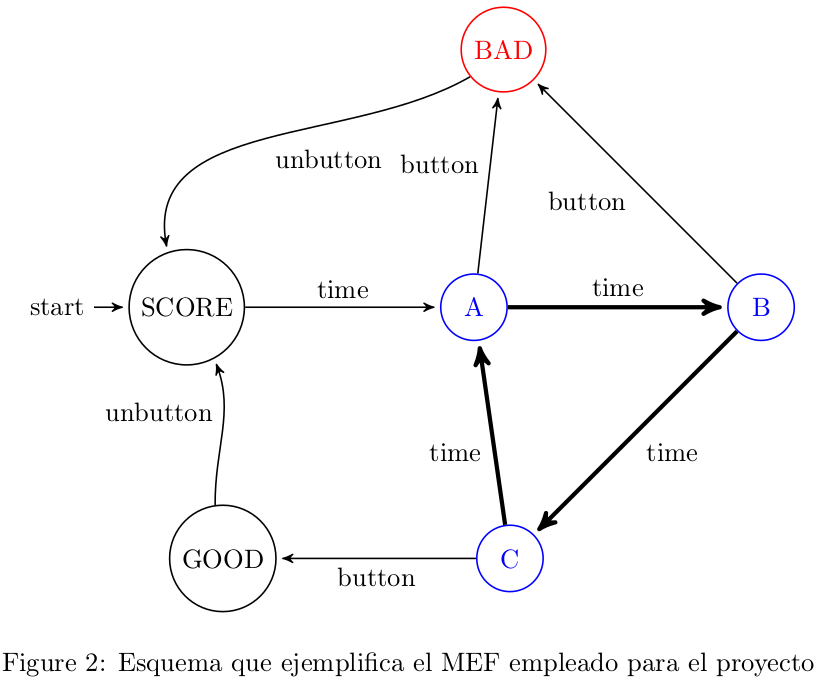
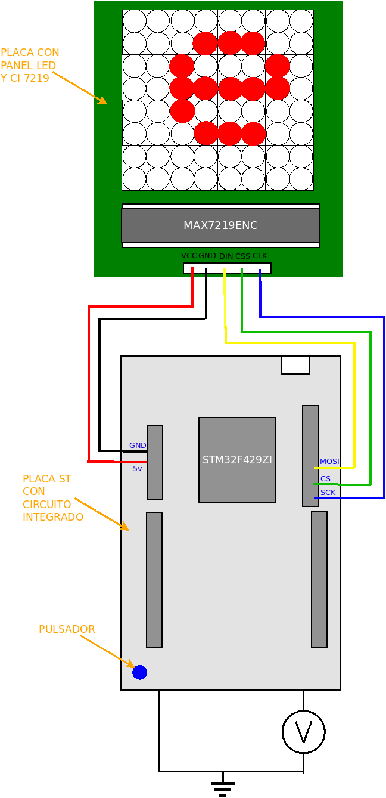

<html><head><meta content="text/html; charset=UTF-8" http-equiv="content-type"></head><body class="c40 doc-content">
<h1>JUEGO DE DESTREZA Y TIMING CON STM32</h1>

(Trabajo Pr&aacute;ctico Final)
<h3 class="c32" id="h.kk6bo6ilm4er">Alumno: Luis G&oacute;mez</h3><h3 class="c32" id="h.2yypqdelrc9d">Plataforma embebida: NUCLEO-STM32F429ZI</h3><h3 class="c32 c42 c36" id="h.2yypqdelrc9d-1"></h3><h1 class="c10" id="h.82aknmbf3c9b">Resumen</h1>
El objetivo principal de este proyecto es desarrollar un juego electr&oacute;nico que indique al uasuario si ha presionado un pulsador en el momento adecuado. De acuerdo con la precisi&oacute;n del jugador, la respuesta puede ser buena o mala.

Para llevar a cabo el trabajo, se utilizar&aacute;n placas comerciales NUCLEO (STM32-F429ZI) y una placa de matriz de LEDs con el circuito integrado MAX7219 (Maxim2023). La informaci&oacute;n de los estados del juego ser&aacute; visualizada en una pantalla de matriz de LEDs, tal como se muestra en la Figura 1.

Se emplear&aacute;n los puertos GPIO para la comunicaci&oacute;n con la pantalla, y el pulsador integrado en la misma placa de desarrollo STM32 ser&aacute; utilizado como control de entrada.

Una parte fundamental del proyecto ser&aacute; la implementaci&oacute;n de un driver para el prototipo, dise&ntilde;ado en consonancia con las bases conceptuales y la estructura de datos estudiadas en la clase. Este driver se construir&aacute; sobre la capa HAL (Hardware Abstraction Layer, o Capa de Abstracci&oacute;n de Hardware) de STM32. Permitir&aacute; controlar diversas acciones del m&oacute;dulo, como desplegar una imagen o una letra en la pantalla de LEDs.

<h1 class="c10" id="h.2vsidbgihip1">Perif&eacute;ricos Empleados: </h1>
El microcontrolador principal que dirigir&aacute; las acciones para este proyecto es la placa de desarrollo STM32-NUCLEO F429ZI. La informaci&oacute;n se desplegar&aacute; en una pantalla de matriz de LEDs, controlada por el chip MAX7219, que actuar&aacute; como actuador, y se utilizar&aacute; un pulsador de la misma placa de desarrollo como sensor.

El MAX7219 es un Circuito Integrado (CI) de visualizaci&oacute;n de c&aacute;todo com&uacute;n compacto, dotado de una entrada/salida serial. Esta funcionalidad facilita la interacci&oacute;n de los microprocesadores con diversos tipos de displays, como displays num&eacute;ricos de 7 segmentos de hasta 8 d&iacute;gitos, displays de barras, o matrices de 64 LEDs individuales. Para este proyecto, se elegir&aacute; la matriz de 64 LEDs individuales, tal como se muestra en la Figura 1, e implementar&aacute; el protocolo de comunicaci&oacute;n a traves de los puertos GPIO.

<h3 class="c32 c36 c42" id="h.2yypqdelrc9d-2"></h3><h1 class="c10" id="h.dmnut0grbj19">Diagrama de estado de MEF.</h1>
Como se muestra en la Figura 2, que representa el Modelo de Estados Finitos (MEF) del juego, este modelo se inicializa en el estado SET, donde se definir&aacute;n los par&aacute;metros iniciales, como el tiempo de espera en cada estado (denominado t=1 en la figura). Tras esto, se pasa al estado A durante un tiempo (condici&oacute;n &nbsp;t = 1), luego al estado B, y posteriormente al estado C, antes de volver al estado A, y as&iacute; sucesivamente.

Este ciclo de transiciones A &rArr; B, B &rArr; C, C &rArr; A continuar&aacute; de manera repetitiva. La &uacute;nica forma de interrumpir este ciclo es a trav&eacute;s de la presi&oacute;n del bot&oacute;n. Dependiendo del estado en el que se encuentre el sistema en ese momento, se pasar&aacute; al estado GOOD o BAD. El estado GOOD se alcanzar&aacute; si el sistema se encuentra en el estado C en el momento de la presi&oacute;n, mientras que el estado BAD ser&aacute; el resultado si el sistema se encuentra en los estados A o B, tal como se indica en el modelo MEF.

<table class="c25"><tr class="c43"><td class="c29" colspan="1" rowspan="1">
Estado
</td><td class="c1" colspan="1" rowspan="1">
Descripci&oacute;n del Estado
</td><td class="c38" colspan="1" rowspan="1">
Acci&oacute;n sobre la Pantalla (Actuador)
</td></tr><tr class="c34"><td class="c29" colspan="1" rowspan="1">
SET
</td><td class="c1" colspan="1" rowspan="1">
Momento en que se muestra &nbsp;el tiempo &quot;delay p&quot; de espera para los estados A, B y C. Tras un tiempo &quot;delay ini&quot;, pasa al estado A y se da inicio a la partida.
</td><td class="c38" colspan="1" rowspan="1">
Imprime letra S
</td></tr><tr class="c34"><td class="c29" colspan="1" rowspan="1">
A
</td><td class="c1" colspan="1" rowspan="1">
Si no se presiona el pulsador, se espera un tiempo &quot;delay p&quot; para pasar al estado B. En caso de presionar el bot&oacute;n, se pasa al estado BAD, indicando que se ha perdido la partida.
</td><td class="c38" colspan="1" rowspan="1">
Imprime letra A
</td></tr><tr class="c34"><td class="c29" colspan="1" rowspan="1">
B
</td><td class="c1" colspan="1" rowspan="1">
Si no se presiona el pulsador, se espera un tiempo &quot;delay p&quot; para pasar al estado C. En caso de presionar el pulsador, se pasa al estado BAD, indicando que se ha perdido la partida.
</td><td class="c38" colspan="1" rowspan="1">
Imprime letra B
</td></tr><tr class="c34"><td class="c29" colspan="1" rowspan="1">
C
</td><td class="c1" colspan="1" rowspan="1">
Si no se presiona el pulsador, se espera un tiempo &quot;delay p&quot; para pasar al estado A. En caso de presionar el bot&oacute;n, se pasa al estado GOOD, indicando que se ha ganado la partida.
</td><td class="c38" colspan="1" rowspan="1">
Imprime letra C
</td></tr><tr class="c34"><td class="c29" colspan="1" rowspan="1">
GOOD
</td><td class="c1" colspan="1" rowspan="1">
Estado que indica al jugador que ha ganado la partida. Se mantendr&aacute; durante un tiempo &quot;delay 2&quot; y luego pasar&aacute; al estado SET, donde se comenzar&aacute; nuevamente la partida.
</td><td class="c38" colspan="1" rowspan="1">
Imprime letra G
</td></tr><tr class="c34"><td class="c29" colspan="1" rowspan="1">
BAD
</td><td class="c1" colspan="1" rowspan="1">
Estado que indica al jugador que ha perdido la partida. Se mantendr&aacute; durante un tiempo &quot;delay 2&quot; y luego pasar&aacute; al estado SET, donde se comenzar&aacute; nuevamente la partida.
</td><td class="c38" colspan="1" rowspan="1">
Imprime letra B
</td></tr></table><h1 class="c10" id="h.uxkwoy6zeovn">Componentes de hardware</h1>
La Figura 3 muestra los componentes de hardware que conforman el proyecto. En la parte superior, se presenta la matriz de LEDs 8x8 junto al Circuito Integrado (CI) MAX7219.

M&aacute;s abajo, se ilustra la placa de desarrollo con el CI STM32-F429ZI, sus puertos de entrada/salida y de energ&iacute;a. Adicionalmente, se destaca un bot&oacute;n en la placa, un interruptor que ser&aacute; empleado para controlar los cambios de estado y, por consiguiente, lo que se muestra en la pantalla.

Finalmente, se indican las conexiones entre ambos m&oacute;dulos: la de poder como +5V (cable rojo), tierra (GND, cable negro), y los cables dedicados a la comunicaci&oacute;n. Estos &uacute;ltimos incluyen: MOSI-CIN (cable amarillo), Cable Select (CS-CSS, cable verde), y Cable de Datos (MOSI-DIN, cable amarillo). Todo esto se alinea con las especificaciones t&eacute;cnicas del CI MAX7219 y las configuraciones de la placa de desarrollo.

Figura 3 Diagrama que muestra de manera esquem&aacute;tica los m&oacute;dulos empleados para el proyecto
<h3 class="c32 c36" id="h.2yypqdelrc9d-3"> 
</h3><h1 class="c10" id="h.7n05wo62as87">Definici&oacute;n de los m&oacute;dulos de programa.</h1><table class="c25"><tr class="c24"><td class="c39" colspan="1" rowspan="1">
Implementaci&oacute;n
</td><td class="c23" colspan="1" rowspan="1">
Prototipos
</td><td class="c16" colspan="1" rowspan="1">
Descripci&oacute;n
</td></tr><tr class="c24"><td class="c39" colspan="1" rowspan="1">
App_MEF.c
</td><td class="c23" colspan="1" rowspan="1">
App_MEF.c
</td><td class="c16" colspan="1" rowspan="1">
Gestiona los estados del juego de acuerdo con el Modelo de Estados Finitos (MEF) definido.
</td></tr><tr class="c24"><td class="c39" colspan="1" rowspan="1">
App_Led.c
</td><td class="c23" colspan="1" rowspan="1">
App_Led.h
</td><td class="c16" colspan="1" rowspan="1">
Encargado de enviar los estados actuales de la MEF a la pantalla de LED.
</td></tr><tr class="c24"><td class="c39" colspan="1" rowspan="1">
App_UART.c
</td><td class="c23" colspan="1" rowspan="1">
App_UART.h
</td><td class="c16" colspan="1" rowspan="1">
Facilita el env&iacute;o de eventos al terminal serial (opcional).
</td></tr><tr class="c24"><td class="c39" colspan="1" rowspan="1">
API_debounce.c
</td><td class="c23" colspan="1" rowspan="1">
API_debounce.h
</td><td class="c16" colspan="1" rowspan="1">
Implementa la verificaci&oacute;n de flancos de se&ntilde;ales para evitar rebotes al utilizar el pulsador.
</td></tr><tr class="c24"><td class="c39" colspan="1" rowspan="1">
API_delay.c
</td><td class="c23" colspan="1" rowspan="1">
API_delay.h
</td><td class="c16" colspan="1" rowspan="1">
Define los intervalos de tiempo durante los cuales se mantendr&aacute; un determinado estado.
</td></tr></table>

<h1 class="c10" id="h.ejghyi7ruk15">Prototipos de las principales funciones p&uacute;blicas y privadas de cada m&oacute;dulo definido .</h1>

<table class="c25"><tr class="c26"><td class="c12" colspan="4" rowspan="1">
Tabla de la App_MEF.c
</td></tr><tr class="c24"><td class="c9" colspan="1" rowspan="1">
Prototipo
</td><td class="c15" colspan="1" rowspan="1">
Descripci&oacute;n
</td><td class="c20" colspan="1" rowspan="1">
Entrada
</td><td class="c30" colspan="1" rowspan="1">
Retorna
</td></tr><tr class="c24"><td class="c9" colspan="1" rowspan="1">
typedef enum{SET, A, B, C, GOOD, BAD} estadoMEF_t;
</td><td class="c15" colspan="1" rowspan="1">
Enumeraci&oacute;n de los posibles estados en el Modelo de Estados Finitos (MEF). Puede ser p&uacute;blica o privada.
</td><td class="c20" colspan="1" rowspan="1">
-
</td><td class="c30" colspan="1" rowspan="1">
-
</td></tr><tr class="c24"><td class="c9" colspan="1" rowspan="1">
void inicializarMEF(void);
</td><td class="c15" colspan="1" rowspan="1">
Inicializa el MEF, definiendo los intervalos de tiempo que el sistema permanecer&aacute; en los estados A, B y C.
</td><td class="c20" colspan="1" rowspan="1">
vac&iacute;o
</td><td class="c30" colspan="1" rowspan="1">
vac&iacute;o
</td></tr><tr class="c24"><td class="c9" colspan="1" rowspan="1">
void actualizarMEF(void);
</td><td class="c15" colspan="1" rowspan="1">
Actualiza el estado actual del MEF en funci&oacute;n del tiempo transcurrido, el estado actual y el estado del bot&oacute;n.
</td><td class="c20" colspan="1" rowspan="1">
vac&iacute;o
</td><td class="c30" colspan="1" rowspan="1">
vac&iacute;o
</td></tr><tr class="c24"><td class="c9" colspan="1" rowspan="1">
char *Lee_estado();
</td><td class="c15" colspan="1" rowspan="1">
Identifica el flanco de la se&ntilde;al, ya sea de subida o bajada, y retorna una descripci&oacute;n correspondiente.
</td><td class="c20" colspan="1" rowspan="1">
-
</td><td class="c30" colspan="1" rowspan="1">
Puntero a caracteres identificando flanco de subida o bajada
</td></tr></table>

<table class="c25"><tr class="c26"><td class="c12" colspan="4" rowspan="1">
Tabla de la App_Led.c
</td></tr><tr class="c24"><td class="c9" colspan="1" rowspan="1">
Prototipo
</td><td class="c15" colspan="1" rowspan="1">
Descripci&oacute;n
</td><td class="c20" colspan="1" rowspan="1">
Entrada
</td><td class="c30" colspan="1" rowspan="1">
Retorna
</td></tr><tr class="c24"><td class="c9" colspan="1" rowspan="1">
typedef enum{} def_Led_t;
</td><td class="c15" colspan="1" rowspan="1">
Enumeraci&oacute;n p&uacute;blica que define las caracter&iacute;sticas de la conexi&oacute;n con la matriz de LED, como el puerto utilizado.
</td><td class="c20" colspan="1" rowspan="1">
-
</td><td class="c30" colspan="1" rowspan="1">
-
</td></tr><tr class="c24"><td class="c9" colspan="1" rowspan="1">
void init_LED(void);
</td><td class="c15" colspan="1" rowspan="1">
Funci&oacute;n p&uacute;blica que inicializa los perif&eacute;ricos necesarios para la matriz de LED, preparando la pantalla para su uso.
</td><td class="c20" colspan="1" rowspan="1">
vac&iacute;o
</td><td class="c30" colspan="1" rowspan="1">
vac&iacute;o
</td></tr><tr class="c24"><td class="c9" colspan="1" rowspan="1">
void update_LED(char);
</td><td class="c15" colspan="1" rowspan="1">
Funci&oacute;n p&uacute;blica que actualiza el estado de la matriz de LED seg&uacute;n el car&aacute;cter de entrada, permitiendo la representaci&oacute;n de distintos s&iacute;mbolos.
</td><td class="c20" colspan="1" rowspan="1">
char
</td><td class="c30" colspan="1" rowspan="1">
vac&iacute;o
</td></tr></table>

<table class="c25"><tr class="c26"><td class="c12" colspan="4" rowspan="1">
Tabla de la App_UART.c
</td></tr><tr class="c24"><td class="c9" colspan="1" rowspan="1">
Prototipo
</td><td class="c15" colspan="1" rowspan="1">
Descripci&oacute;n
</td><td class="c20" colspan="1" rowspan="1">
Entrada
</td><td class="c30" colspan="1" rowspan="1">
Retorna
</td></tr><tr class="c24"><td class="c9" colspan="1" rowspan="1">
bool_t uartInit();
</td><td class="c15" colspan="1" rowspan="1">
Funci&oacute;n para inicializar la UART. Imprime los par&aacute;metros de configuraci&oacute;n en la terminal serie.
</td><td class="c20" colspan="1" rowspan="1">
-
</td><td class="c30" colspan="1" rowspan="1">
bool_t: true&nbsp;o false, seg&uacute;n si la conexi&oacute;n se establece o no.
</td></tr><tr class="c24"><td class="c9" colspan="1" rowspan="1">
void uartSendString(uint8_t * pstring);
</td><td class="c15" colspan="1" rowspan="1">
Funci&oacute;n que recibe un puntero a un string para enviar por la UART hasta el car&aacute;cter &#39;\0&#39;. Utiliza la funci&oacute;n HAL_UART_Transmit(...)&nbsp;para transmitir el string.
</td><td class="c20" colspan="1" rowspan="1">
uint8_t * pstring: puntero al string
</td><td class="c30" colspan="1" rowspan="1">
vac&iacute;o
</td></tr><tr class="c24"><td class="c9" colspan="1" rowspan="1">
void uartSendStringSize(uint8_t * pstring, uint16_t size)
</td><td class="c15" colspan="1" rowspan="1">
Funci&oacute;n p&uacute;blica que recibe un puntero a un string y un entero con la cantidad de caracteres que debe enviar por la UART. Utiliza HAL_UART_Transmit(...)&nbsp;para enviar.
</td><td class="c20" colspan="1" rowspan="1">
uint8_t * pstring: puntero al string, uint16_t size: tama&ntilde;o del string
</td><td class="c30" colspan="1" rowspan="1">
vac&iacute;o
</td></tr><tr class="c24"><td class="c9" colspan="1" rowspan="1">
void uartReceiveStringSize(uint8_t * pstring, uint16_t size)
</td><td class="c15" colspan="1" rowspan="1">
Funci&oacute;n p&uacute;blica que recibe un puntero a un string y un entero con la cantidad de caracteres que debe recibir por la UART. Utiliza HAL_UART_Transmit(...)&nbsp;para recibir.
</td><td class="c20" colspan="1" rowspan="1">
uint8_t * pstring: puntero al string, uint16_t size: tama&ntilde;o del string
</td><td class="c30" colspan="1" rowspan="1">
vacio 
</td></tr></table>

<h2 class="c47" id="h.5qvvrwkfawvu"></h2>

<table class="c25"><tr class="c26"><td class="c12" colspan="4" rowspan="1">
Tabla de la API_debounce.c
</td></tr><tr class="c24"><td class="c17" colspan="1" rowspan="1">
Prototipo
</td><td class="c21" colspan="1" rowspan="1">
Descripci&oacute;n
</td><td class="c20" colspan="1" rowspan="1">
Entrada
</td><td class="c30" colspan="1" rowspan="1">
Retorna
</td></tr><tr class="c24"><td class="c17" colspan="1" rowspan="1">
bool_t readKey();
</td><td class="c21" colspan="1" rowspan="1">
Funci&oacute;n p&uacute;blica que lee una variable interna y devuelve si la tecla fue presionada. Si retorna true, reinicia el estado de la variable (lo establece en false).
</td><td class="c20" colspan="1" rowspan="1">
Vac&iacute;o
</td><td class="c30" colspan="1" rowspan="1">
bool_t: estado de la tecla (true&nbsp;si fue presionada, false&nbsp;en caso contrario).
</td></tr><tr class="c24"><td class="c17" colspan="1" rowspan="1">
void debounceFSM_init()
</td><td class="c21" colspan="1" rowspan="1">
Funci&oacute;n que inicializa la m&aacute;quina de estados finita (FSM) para el control de rebote, estableciendo el estado inicial.
</td><td class="c20" colspan="1" rowspan="1">
Vac&iacute;o
</td><td class="c30" colspan="1" rowspan="1">
Vac&iacute;o
</td></tr><tr class="c24"><td class="c17" colspan="1" rowspan="1">
void debounceFSM_update(delaydebounce_t* delay)
</td><td class="c21" colspan="1" rowspan="1">
Funci&oacute;n que actualiza la FSM para el control de rebote. Lee las entradas, eval&uacute;a las condiciones de transici&oacute;n de acuerdo con el estado actual de la FSM y actualiza el estado y las salidas correspondientes.
</td><td class="c20" colspan="1" rowspan="1">
delaydebounce_t* delay: puntero a la instancia de retardo.
</td><td class="c30" colspan="1" rowspan="1">
Vac&iacute;o
</td></tr><tr class="c24"><td class="c17" colspan="1" rowspan="1">
char *readStatus();
</td><td class="c21" colspan="1" rowspan="1">
Funci&oacute;n que identifica si se trata de un flanco de subida o de bajada, lo cual es esencial para detectar cambios de estado en una se&ntilde;al.
</td><td class="c20" colspan="1" rowspan="1">
Vac&iacute;o
</td><td class="c30" colspan="1" rowspan="1">

</td></tr></table>

<h3 class="c32 c36" id="h.jvai5obof5db"></h3>

<table class="c25"><tr class="c26"><td class="c12" colspan="4" rowspan="1">
Tabla de la API_delay.c
</td></tr><tr class="c24"><td class="c17" colspan="1" rowspan="1">
Prototipo
</td><td class="c21" colspan="1" rowspan="1">
Descripci&oacute;n
</td><td class="c20" colspan="1" rowspan="1">
Entrada
</td><td class="c30" colspan="1" rowspan="1">
Retorna
</td></tr><tr class="c24"><td class="c17" colspan="1" rowspan="1">
bool_t readKey();
</td><td class="c21" colspan="1" rowspan="1">
Funci&oacute;n p&uacute;blica que lee una variable interna y devuelve si la tecla fue presionada. Si retorna true, reinicia el estado de la variable (lo establece en false).
</td><td class="c20" colspan="1" rowspan="1">
Vac&iacute;o
</td><td class="c30" colspan="1" rowspan="1">
bool_t: estado de la tecla (true&nbsp;si fue presionada, false&nbsp;en caso contrario).
</td></tr><tr class="c24"><td class="c17" colspan="1" rowspan="1">
void debounceFSM_init()
</td><td class="c21" colspan="1" rowspan="1">
Funci&oacute;n que inicializa la m&aacute;quina de estados finita (FSM) para el control de rebote, estableciendo el estado inicial.
</td><td class="c20" colspan="1" rowspan="1">
Vac&iacute;o
</td><td class="c30" colspan="1" rowspan="1">
Vac&iacute;o
</td></tr><tr class="c24"><td class="c17" colspan="1" rowspan="1">
void debounceFSM_update(delaydebounce_t* delay)
</td><td class="c21" colspan="1" rowspan="1">
Funci&oacute;n que actualiza la FSM para el control de rebote. Lee las entradas, eval&uacute;a las condiciones de transici&oacute;n de acuerdo con el estado actual de la FSM y actualiza el estado y las salidas correspondientes.
</td><td class="c20" colspan="1" rowspan="1">
delaydebounce_t* delay: puntero a la instancia de retardo.
</td><td class="c30" colspan="1" rowspan="1">
Vac&iacute;o
</td></tr></table>

</body></html>
